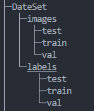

# VOC_DIR 用于 YOLO 数据集创建
### 如何使用

#### 1.检查如下目录是否清空
    ├─DateSet
    ├─images
    ├─labels_txt
    └─labels_xml
#### 2.将自己的数据集放入images文件夹

#### 3.打开labelimg

#### 4.选择保存xml路径，并标注数据集

#### 5.转换xml为txt格式
    python xml_to_txt.py
#### 6.通过labels_txt与images构建DateSet数据集得到如下目录

    
    DateSet
    ├─images
    │  ├─test
    │  ├─train
    │  └─val
    └─labels
    │   ├─test
    │   ├─train
    │   └─val

### 文件类型讲解

#### 文件夹目录：
    Mode                 LastWriteTime         Length   Name
    d-----         2023/11/4     13:56                  DateSet
    d-----         2023/11/4     13:33                  images
    d-----         2023/11/4     13:40                  labels_txt
    d-----         2023/11/4     13:39                  labels_xml
    -a----         2023/11/4     13:56           2964   dateset_init.py
    -a----         2023/11/4     14:08             72   README.md
    -a----         2023/11/4     12:51           1725   xml_to_txt.py

#### DateSet目录:

    ├─images        
    │  ├─test       图片文件：测试集
    │  ├─train      图片文件：训练集
    │  └─val        图片文件：验证集
    |
    └─labels        
        ├─test      标签文件：测试集
        ├─train     标签文件：训练集
        └─val       标签文件：验证集
#### images文件夹：
    用于存放使用 labelimg 标注的数据集图片。
#### lables_xml:
    使用 labelimg 标注 xml类型文件     #方便查看特征
#### lables_txt:
    用于 labelimg 标注 txt类型文件     #用于 yolo 分类训练
#### xml_to_txt.py：
    用于将 labelimg 标注完的 xml文件 转为 yolo训练使用的 txt文件格式
#### dateset_init.py：
    ├─images
    └─labels_txt
    将上述文件夹分别转为对应的 测试集，训练集，验证集
    ├─images        
    │  ├─test       图片文件：测试集
    │  ├─train      图片文件：训练集
    │  └─val        图片文件：验证集
    |
    └─labels        
        ├─test      标签文件：测试集
        ├─train     标签文件：训练集
        └─val       标签文件：验证集